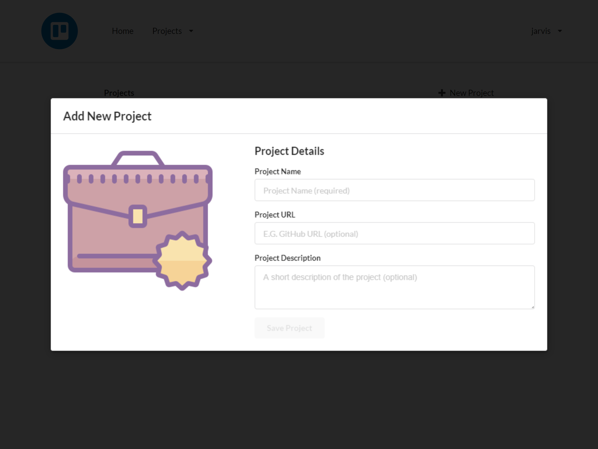
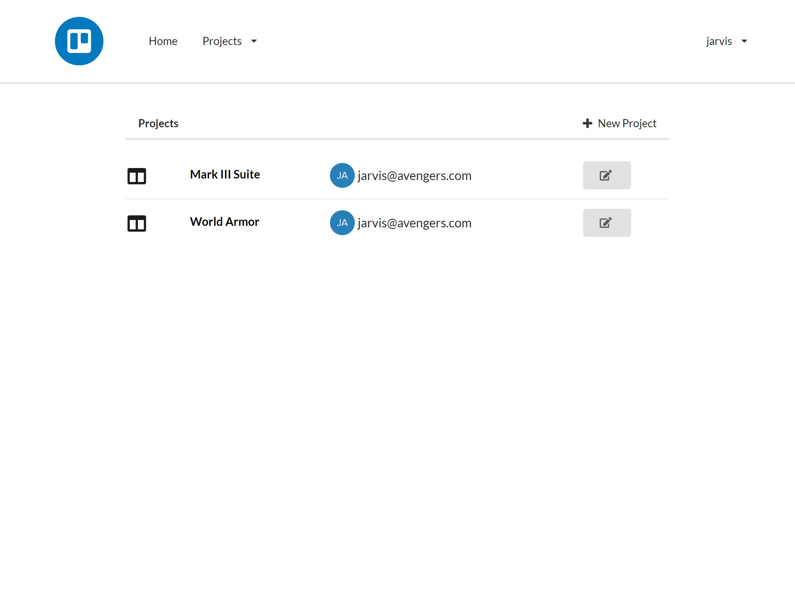
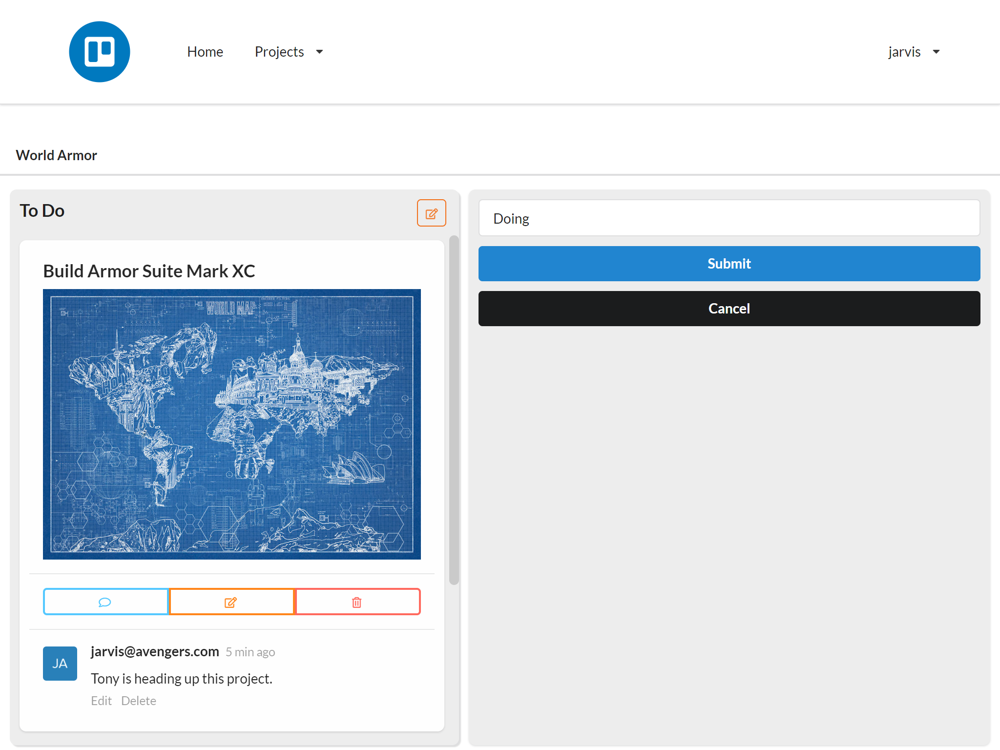

<div style="padding-top: 5px; padding-bottom: 10px;">
  <h1 align="center">GraphQL Kanban App.</h1>
  <h2 align="center">
    A Jira/Trello like clone powered by<br />
    <a href="https://dgraph.io/slash-graphql" target="_blank">
      
    </a><br />
    A fully-managed GraphQL backend service
  </h2>
</div>

Tech stack:
* Backend:
  * [Slash GraphQL](https://dgraph.io/graphql)
  * [Auth0](https://auth0.com/)
* Frontend
  * [React](https://reactjs.org/)
  * [Semantic UI React](https://react.semantic-ui.com/)
  * [React Router Dom](https://www.npmjs.com/package/react-router-dom)
  * [Apollo client v3.0](https://www.apollographql.com/docs/)
  * [GraphQL Code Generator](https://graphql-code-generator.com/) 
  * [Auth0 React](https://www.npmjs.com/package/@auth0/auth0-react)
  * [React Beautiful DND](https://www.npmjs.com/package/react-beautiful-dnd)

## Screenshots





## Forking and running this application locally

Soon, this app will be available for one-click deploy on Slash GraphQL, until then, do the following to run this app locally:

[Fork this project](https://docs.github.com/en/github/getting-started-with-github/fork-a-repo) into your own Github account.
[Clone the project](https://docs.github.com/en/github/getting-started-with-github/fork-a-repo#step-2-create-a-local-clone-of-your-fork) onto your local machine.

Integrate with Auth0:

1. Sign up for Auth0 at https://auth0.com/
2. Create a new Application (use Single Page Application type)
3. Go to you Application's Settings
4. Set the `Allowed Callback URLs`, `Allowed Logout URLs`, and `Allowed Web Origins` to `http://localhost:3000/` (and/or your production deployed URL)
5. Copy the Domain and paste into `.env.development` and `.env.production` as `REACT_APP_AUTH0_DOMAIN`
6. Copy the Client ID and paste into `.env.development` and `.env.production` as `REACT_APP_AUTH0_CLIENT_ID`
7. Copy the Client ID and paste into the last line of `/src/schema.graphql` replacing the value for the key `Audience`. (This should still be wrapped inside of an array e.g. `"Audience":["your Client ID"]`)
8. Download your .pem certificate from `[Domain]/pem` and save to a local file not in the repo
9. Open this downloaded .pem file in your favorite text editor (We recommend Visual Studio Code)
10. Replace all line breaks with the `\n` characters. (e.g. `-----BEGIN CERTIFICATE-----\n...\n...\n-----END CERTIFICATE-----`)
11. Copy the updated contents of the file from the previous step and Paste into the last line of `/src/schema.graphql` replacing the value for the key `VerificationKey`

Integrate with Slash GraphQL:

1. Sign up for Slash GraphQL at https://slash.dgraph.io/
2. Create a new Backend.
3. Copy the GraphQL Backend URL to `.env.development` and `.env.production` as `REACT_APP_GRAPHQL_ENDPOINT`
4. Decide if you want to use a different Claims key. If not, skip to step ___
5. Enter a new unique Claims Key into `.env.development` and `.env.production` as `REACT_APP_AUTH0_CLAIMS_KEY`
6. Copy this Claims Key into the last line of `/src/schema.graphql` replacing the value for the key `Namespace`
7. Save the `/src/schema.graphql` file and copy its contents.
8. Paste the schema content into your Slash GraphQL Backend at https://slash.dgraph.io/_/schema.
9. Click on the `Deploy` button.

Generating Types:

If you modify your GraphQL schema (other than changing the Dgraph.Authorization line) or if you add, change, or remove
any of the operations.graphql files, you should generate new Types. This process will add new Typescript types as well
as generating Apollo Client hooks making CRUD operations easier to implement. To generate new types follow these steps:

1. Copy your GraphQL Backend URL and paste it into `/codegen.yml` as the value for the `schema` key.
2. If you no longer have any `src/**/*.graphql` files, change `withHooks` to `false` to prevent errors.
3. From the command line in your repo's directory, run `npm run generate-types`

Launch the Application:

One of the best parts about a React application is the ease to develop on your local machine. To run your application,

1. Open your favorite command line tool
2. Run `npm run start`. This will start the application and open your browser pointed to `https://localhost:3000`

Join our active [community](https://discuss.dgraph.io/) of fellow Slash GraphQL users and developers.

Want to learn more about Slash, GraphQL, and React? Visit https://dgraph.io/learn

# Starting an app like this from scratch

Do you want to start your own React, Slash GraphQL, Apollo, and Auth0 application? Try following these steps:

```sh
npx create-react-app graphql-kanban --template typescript
cd graphql-kanban
npm install @apollo/client @auth0/auth0-react graphql markdown-to-jsx react-beautiful-dnd react-router-dom semantic-ui-css semantic-ui-react

npm install --save-dev @graphql-codegen/add @graphql-codegen/cli @graphql-codegen/introspection @graphql-codegen/near-operation-file-preset @graphql-codegen/typescript @graphql-codegen/typescript-operations @graphql-codegen/typescript-react-apollo @types/react-beautiful-dnd @types/react-router-dom @types/semantic-ui
```

GraphQL Code Generator can generate types, hooks, components, and HOCs for your project.

```sh
npm graphql-codegen init
...answer questions...
```

Note: If you enabled withHooks but don't have any .graphql files it will cause errors

Set up scripts in `/package.json`

```json
"scripts": {
    ...
    "generate-types": "graphql-codegen --config codegen.yml"
}
```

From a command line within your project's directory you can run

```sh
npm run generate-types
```

Anytime your types change or you add a new query/mutation to a .graphql file in the app, you should run the above command for GraphQL Code Generator to regenerate.

Feel free to browse the code in this repository to see how we implemented the following:

- Wrapped the App with the Auth0 Provider in `/src/index.tsx`
- Configured the Apollo Client with `/src/ApolloConfig.tsx`
- Added Apollo Provider in `/src/App.tsx`
- Created Routes with BrowserRoutes in `/src/App.tsx`
- Added Beautiful DND Context around the Kanban boards in `/src/components/Board/board.tsx`
- Added Draggables and Droppables in `/src/components/Column/column.tsx` and `/src/components/Ticket/ticket.tsx`
- Use the generated GraphQL types and Apollo hooks throughout the components based on the `operations.graphql` files.

